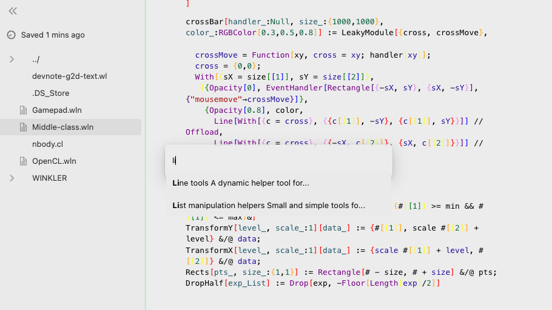

# Snippets package for WLJS Frontend
**An extension for [WLJS-Editor](https://github.com/JerryI/wljs-editor) that adds snippets (pieces of code like Wolfram Function Repository) feature**

Work only with **WLJS Frontend >= 0.9.8**, check [Releases](https://github.com/JerryI/wolfram-js-frontend/releases)

Use it with a hotkey combination `Win+P` or (`Cmd+P` on Mac)



Each snippet is a notebook, stored in `library/` folder, which is automatically scanned on startup. Each file contains special field, marked by `.exports` in the first line, will be pasted into the running notebook, when the snippet has been called.

For instance

*cell 1*
```markdown
    ## Title (used in search)
    Short description...
```

*cell 2*
```mathematica
.exports
myVeryUsefulFunction[x_] := x // ToString
```

*cell 3*
```mathematica
.exports
.html
<p>Other cell</p>
```

...

Then, if one will call this snippet from the searbar it will insert the cells marked with `.exports`.

## Contribution
Feel free to fork and add whatever you want to `library` folder, I will merge it to the master and everyone who are using WLJS Frontend will receive your snippet.

## License
Project is released under the GNU General Public License (GPL).
